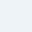

<h3 align="center">
   
  Antarctic Theme
</h3>

The clean, snowy surroundings of the South Pole inspire this chilly color scheme called Antarctic. The combination of white, blue, and accent tones evokes the serenity of the South Pole on your screen. Any computer would benefit from the color scheme's ability to create a serene and revitalizing ambiance and even drop your CPU temps. It can be applied not only to software but any design to give it a sophisticated, elegant look or a modern, minimalist feel.

  

## Palette
| **Name** 	                | **Hex** 	| **RGB** 	        | **HSL** 	                | 🎨|
|:---------:	            |:-------:	|:-------:	        |:-------:	                |:-------:|
|Frost Ice                  |`#F3FBFF`  |`rgb(243,251,255)` |`hsl(200,100%,97.6%)`      | |   
|Pure Ice (base)            |`#EDF3F7`  |`rgb(237,243,247)` |`hsl(204,38.5%,94.9%)`     | |
|Calm Ice                   |`#E1EAEF`  |`rgb(225,234,239)` |`hsl(201.4,30.4%,91%)`     ||
|Rough Ice                  |`#D3DEE2`  |`rgb(211,222,226)` |`hsl(196,20.5%,85.7%)`     ||
|Rocky Ice                  |`#6F7776`  |`rgb(111,119,118)` |`hsl(172.5,3.5%,45.1%)`    ||   
|Deep Water                 |`#344C59`  |`rgb(52,76,89)`    |`hsl(201.1,26.2%,27.6%)`   ||
|Midnight Glacier           |`#50888C`  |`rgb(80,136,140)`  |`hsl(184,27.3%,43.1%)`     ||
|Glacial Teal 	            |`#26BEC6`  |`rgb(38,190,198)`  |`hsl(183,67.8%,46.3%)`     ||
|Frosty Jade  	            |`#40B289`  |`rgb(64,178,137)`  |`hsl(158.4,47.1%,47.5%)`   ||
|Polar Abyss                |`#1D2D33`  |`rgb(29,45,51)`    |`hsl(196.4,27.5%,15.7%)`   ||
|Cold Amethyst              |`#AD4D9B`  |`rgb(173,77,155)`  |`hsl(311.3,38.4%,49%)`     ||
|Shinny Cold Amethyst       |`#D34AC0`  |`rgb(211,74,192)`  |`hsl(308.3,60.9%,55.9%)`   ||
|Crimson Tundra             |`#99372C`  |`rgb(153,55,44)`   |`hsl(6.1,55.3%,38.6%)`     ||
|Shinny Crimson Tundra      |`#99372C`  |`rgb(201,50,39)`   |`hsl(4.1,67.5%,47.1%)`     ||
|Sea Breeze                 |`#6FA4AD`  |`rgb(111,164,173)` |`hsl(188.7,27.4%,55.7%)`   ||
|Umber Home                 |`#CD8120`  |`rgb(205,129,32)`  |`hsl(33.6,73%,46.5%)`      ||
|Shinny Umber Home          |`#E2741A`  |`rgb(226,116,26)`  |`hsl(27,79.4%,49.4%)`      ||

## Ports
[Visual Studio Code](https://github.com/AntarcticTheme/VS-Code)

[Visual Studio](https://github.com/AntarcticTheme/visual-studio)

[Windows Terminal](https://github.com/AntarcticTheme/Windows-Terminal)

[Oh My Posh](https://github.com/AntarcticTheme/Oh-My-Posh)

## Thanks
Thank you for checking it out. Right now, it is just me working on Antarctic; I hope this project can grow and attract more attention; not everybody is a fan of dark mode, and this is for those who want a light mode with contrast and cool colors.

You can find me @

  
  

<h3 align="center">
   
</h3>